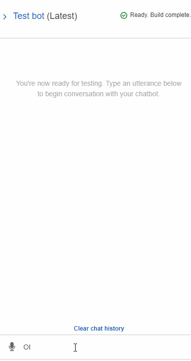
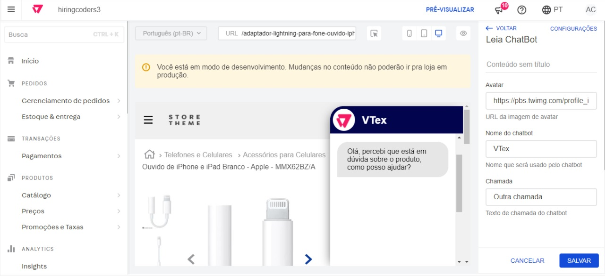
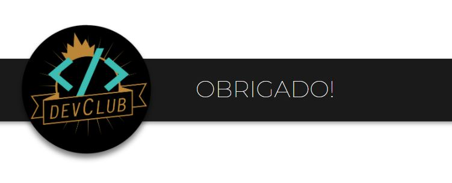

# DevClub - Grupo 3 Hiring Coders
*Projeto Semifinal - Hiring Coders (Desafio do Chatbot)*

## 🎯 O desafio
> Desenvolver um canal de comunicação baseado em Chatbot, genérico, que possa “plugar" em outros marketplaces. Este chatbot deve se propor a resolver algum problema de comunicação.

Nos propomos a utilizar o chatbot para mitigar o  **Abandono de compra**, detectando o movimento de fechamento da página e tentando, através da abertura da janela de chat, interagir e entender o usuário, visando converter a visita do cliente em uma compra.

## 🚀 Solução proposta
Com base no desafio e no problema aceito, nasceu a *Leia*, personagem do nosso chatbot. Seu atendimento se resume em 4 frentes:
1. Característica do produto: propor produtos similares baseado no produto que está sendo visualizado
2. Preço: Verificar se existe algum cupom de desconto, promoção relativo ao produto. Pode ainda propor parcelar ou dividir em dois cartões de crédito.
3. Prazo de entrega: Disponibiliza serviços como retirar no ponto de venda ou Entrega Expressa
4. Auxilio na busca: Mostra de forma resumida produtos relevantes baseado na busca do cliente, na própria conversa com a *Leia*

## 📱 Telas
### Chatbot Lex

### Aplicação do Chatbot na loja

### Configurações do chatbot no Painel VTEX

## ⚙ Tecnologias / Utilização

### VTEX Store Block
Projeto da Loja construido com tecnologia VTEX, para abrigar o chatbot e disponibilizar API para que o bot consiga consultar
- [Repositório](https://github.com/GamaDevClub/leia_chatbot)
- [Documentação API Search](https://developers.vtex.com/reference/search-3)

### AWS Amplify Framework
O Amplify Framework fornece um conjunto de bibliotecas, componentes de UI, uma CLI e diversas outras ferramentas para facilitar o desenvolvimento de apps utilizando as ferramentas da AWS. [Leia mais](https://aws.amazon.com/pt/amplify/framework/)

- [Repositório](https://github.com/GamaDevClub/leia-bot-dev)

### Amazon Lex - AWS Chatbot
O Amazon Lex é um serviço para a criação de interfaces de conversa em qualquer aplicativo usando voz e texto.
O arquivo abaixo pode ser baixado e importado em uma Cloud da AWS para reproduzir a *Leia*.
- [Arquivo .zip AWS Lex](assets/leiabot_dev_1_0dadbe2b-49ff-4883-86e7-a831f9f19e60_Bot_LEX_V2.zip)

### AWS Lambda Function
Faça download de um arquivo .ZIP que inclui o pacote de implantação (código e bibliotecas) e/ou um [arquivo SAM (Modelo de aplicativo sem servidor) da AWS](https://docs.aws.amazon.com/lambda/latest/dg/deploying-lambda-apps.html#serverless_app) que define a função, as fontes de eventos e as permissões.
Você ou outros usuários com os quais você compartilha este arquivo podem usar o AWS CloudFormation para implantar e gerenciar um aplicativo sem servidor semelhante. [Saiba mais](https://docs.aws.amazon.com/lambda/latest/dg/serverless-deploy-wt.html#serverless-deploy) sobre como implantar um aplicativo sem servidor com o AWS CloudFormation.

- [Arquivo .zip](assets/leiaHook-pacote-implantação.zip)
- [Arquivo SAM](assets/leiaHook-SAM.yaml)

## 🧭 Roadmap
- Persistir em um Banco de Dados e Criar uma interface amigável para analisar os feedbacks dos usuários que a *Leia* não conseguir ajudar
- 

## 💪 Nosso time

- Alda Lopes < [LinkedIn](https://www.linkedin.com/in/alda-monte-pmp-31a626b1/) . [Github](https://github.com/aldaclopes) >
- André Vinicius Fanchini Terrasan < [LinkedIn](https://www.linkedin.com/in/andreterrasan) . [Github](https://github.com/andrevft) >
- Antonio Thiele < [LinkedIn](https://www.linkedin.com/in/antoniothiele/) . [Github](https://github.com/capelaum) >
- Bruno Luiz de Siqueira < [LinkedIn](https://www.linkedin.com/in/brunoluizdesiqueira) . [Github](https://github.com/brunoluizdesiqueira) >
- George Pereira de Azevedo Maia < [LinkedIn](https://www.linkedin.com/in/georgemaia/) . [Github](https://github.com/georgemaia) >
- Jackson Alves Sousa < [LinkedIn](https://www.linkedin.com/in/jackson-alves541/) . [Github](https://github.com/jackson541/) >
- Luís Vinicius Capelletto < [LinkedIn](https://www.linkedin.com/in/luis-capelletto/) . [Github](https://github.com/antoniocarlos) >
- Vinicius Passos < [LinkedIn](https://www.linkedin.com/in/vtpa/) . [Github](https://github.com/vtpa) >
- Vitor José da Silva < [LinkedIn](https://www.linkedin.com/in/vitor-jose/) . [Github](https://github.com/vitormj) >
- Vivian Barbosa Reis < [LinkedIn](https://www.linkedin.com/in/vivianbarbosareis/) . [Github](https://github.com/vivianreis) >

