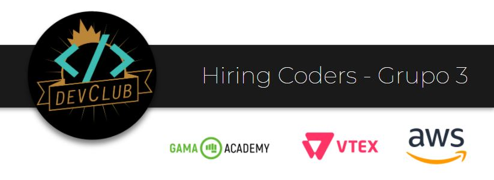
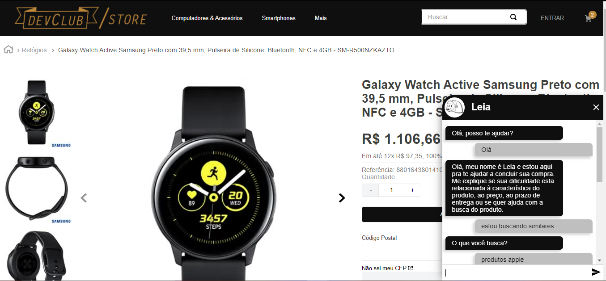
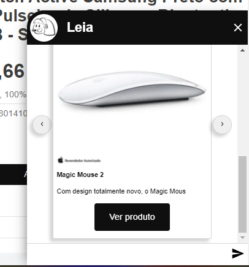
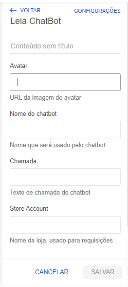
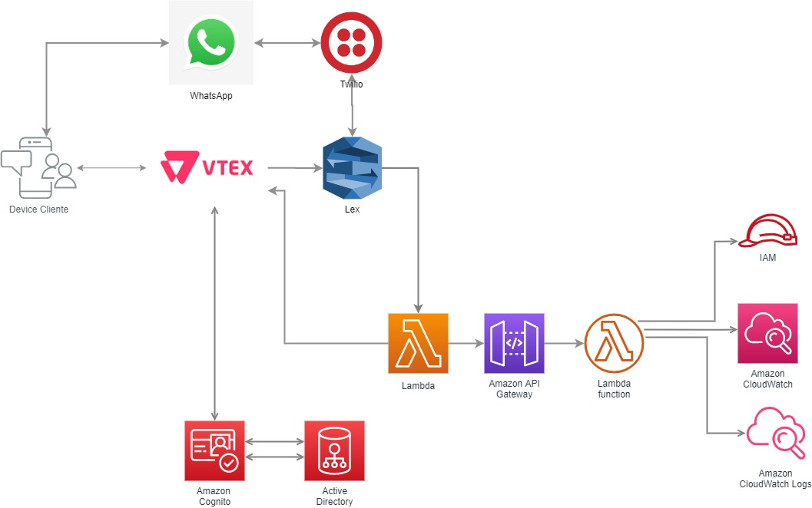
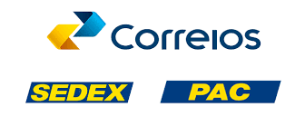

# DevClub - Grupo 3 Hiring Coders
*Projeto Semifinal - Hiring Coders (Desafio do Chatbot)*

## 🎯 O desafio
> Desenvolver um canal de comunicação baseado em Chatbot, genérico, que possa “plugar" em outros marketplaces. Este chatbot deve se propor a resolver algum problema de comunicação.

Nos propomos a utilizar o chatbot para mitigar o  **Abandono de compra**, detectando o movimento de fechamento da página e tentando, através da abertura da janela de chat, interagir e entender o usuário, visando converter a visita do cliente em uma compra.

## 🚀 Solução proposta
Com base no desafio e no problema aceito, nasceu a *Leia*, personagem do nosso chatbot. Seu atendimento se resume em 4 frentes:
1. Característica do produto: propor produtos similares baseado no produto que está sendo visualizado
2. Preço: Verificar se existe algum cupom de desconto, promoção relativo ao produto. Pode ainda propor parcelar ou dividir em dois cartões de crédito.
3. Prazo de entrega: Disponibiliza serviços como retirar no ponto de venda ou Entrega Expressa
4. Auxilio na busca: Mostra de forma resumida produtos relevantes baseado na busca do cliente, na própria conversa com a *Leia*

**[🔗 Link para a loja teste da solução](https://hiringcoders3.myvtex.com/)**

## Leia chatbot

Leia chatbot é um robô desenvolvido para o ecossistema Vtex io.
No momento da detecção de abandono de compra o chatbot interagi com o usuário, tentando converter a visita do cliente em uma compra.

O chatbot Leia está disponível para instalação em qualquer tema Vtex.

### USABILIDADE

O bot torna-se ativo de duas formas:
1. Por meio do hover sobre o seu header.
2. Por meio da saida do cursor pelo topo da página.

O bot pode ser fechado clicando no X. Esse procedimento limpa o histórico da conversa.

### FEATURES

1. Foi desenvolvido um sistema de ui próprio para a comunicação com o sistema lex da AWS. Por meio disso possibilitamos a visualização de responseCards dentro do chat.
2. O bot percebe o contexto de produto de onde está sendo consultado possibilitando melhores indicações.

### CUSTOMIZAÇÃO

Leia chatbot é plug and play!
Basta instalar em seu tema e preencher os dados na sessão de administrador da loja.

1. URL da imagem de avatar
2. Nome que será usado pelo chatbot
3. Texto de chamada do chatbot
4. Nome da loja, usado para requisições

### TEMA DA LOJA

- [Repositório](https://github.com/GamaDevClub/DevClub_theme)

Foi desenvovido um tema minimalista baseado em tons de preto e dourado. Essa escolha foi feita para simular o período de black friday.

## 📱 Telas
### Chatbot Lex

### Chabot no whatsApp via twilio

## ⚙ Tecnologias / Utilização

### Desenho da arquitetura técnica

### VTEX Store Block
Projeto da Loja construido com tecnologia VTEX, para abrigar o chatbot e disponibilizar API para que o bot consiga consultar
- [Repositório](https://github.com/GamaDevClub/leia_chatbot)
- [Documentação API Search](https://developers.vtex.com/reference/search-3)

### AWS Amplify Framework
O Amplify Framework fornece um conjunto de bibliotecas, componentes de UI, uma CLI e diversas outras ferramentas para facilitar o desenvolvimento de apps utilizando as ferramentas da AWS. [Leia mais](https://aws.amazon.com/pt/amplify/framework/)

- [Repositório](https://github.com/GamaDevClub/leia-bot-dev)

### Amazon Lex - AWS Chatbot
O Amazon Lex é um serviço para a criação de interfaces de conversa em qualquer aplicativo usando voz e texto.
O arquivo abaixo pode ser baixado e importado em uma Cloud da AWS para reproduzir a *Leia*.
- [Arquivo .zip AWS Lex](assets/leiabot_dev_1_0dadbe2b-49ff-4883-86e7-a831f9f19e60_Bot_LEX_V2.zip)

### AWS Lambda Function
Faça download de um arquivo .ZIP que inclui o pacote de implantação (código e bibliotecas) e/ou um [arquivo SAM (Modelo de aplicativo sem servidor) da AWS](https://docs.aws.amazon.com/lambda/latest/dg/deploying-lambda-apps.html#serverless_app) que define a função, as fontes de eventos e as permissões.
Você ou outros usuários com os quais você compartilha este arquivo podem usar o AWS CloudFormation para implantar e gerenciar um aplicativo sem servidor semelhante. [Saiba mais](https://docs.aws.amazon.com/lambda/latest/dg/serverless-deploy-wt.html#serverless-deploy) sobre como implantar um aplicativo sem servidor com o AWS CloudFormation.

- [Arquivo .zip](assets/leiaHook-pacote-implantação.zip)
- [Arquivo SAM](assets/leiaHook-SAM.yaml)

### Amazon CloudWatch - Monitoração do Lex e Lambda
As execuções do Lex e Lambda são monitoradas. A partir dos logs de execução capturados foram criados Dashboards no CloudWatch para monitorar o tempo de respostas de ambos, volume de execuções e quantidade de erros. É possível consultar os dashboards através do link:

- [Dashboard AWS Lex: Leiadev_bot](https://cloudwatch.amazonaws.com/dashboard.html?dashboard=Leia_Watch&context=eyJSIjoidXMtZWFzdC0xIiwiRCI6ImN3LWRiLTU2Mjk0ODc3MTUzNiIsIlUiOiJ1cy1lYXN0LTFfdVlVMVhUZDg4IiwiQyI6IjNmZWY0c2Y2OWNlcGtzNmtodXY5Z2YwMm9pIiwiSSI6InVzLWVhc3QtMTo3N2FmMTdiNy1kYzE0LTQ4YTItOWU3Zi01YzRlNjE2NjkwZGQiLCJNIjoiUHVibGljIn0=)

- [Dashboard AWS Lambda Function: LeiaHook](https://cloudwatch.amazonaws.com/dashboard.html?dashboard=LeiaHook&context=eyJSIjoidXMtZWFzdC0xIiwiRCI6ImN3LWRiLTU2Mjk0ODc3MTUzNiIsIlUiOiJ1cy1lYXN0LTFfdVlVMVhUZDg4IiwiQyI6IjNmZWY0c2Y2OWNlcGtzNmtodXY5Z2YwMm9pIiwiSSI6InVzLWVhc3QtMTozYTEyM2Q3Zi0yYzYwLTRjNGUtYjdmNy01NjNiOWI0YWZiMGUiLCJNIjoiUHVibGljIn0=)

### Solução  para entrega das compras
 - Implementada a opção de entrega via Correios PAC (entrega econômica) ou Sedex (entrega expressa0,  através de configurações no VTEX ADMIN

 - Implementada a opção de retirada em loja fictícia localizada no centro de São Paulo, para clientes residentes na região metropolitana da Capital, através de configurações no VTEX ADMIN.
 
 ### Solução de pagamentos
  - Implementada opções de pagamentos por boleto ou cartões Visa, AMEX e Mastercard, através de API da Pagar.me, com opções de parcelamento nos cartões e emissão online do Boleto.
  
 
## 🧭 Roadmap
- Persistir em um Banco de Dados e Criar uma interface amigável para analisar os feedbacks dos usuários que a *Leia* não conseguir ajudar
- Utilizando a *API Gateway*, implementar o entendimento de contexto pelo bot, permitindo que o backend da *Leia* saiba em quais produtos o cliente nevegou, melhorando a capacidade de ajudar
- Implementar a exibição de imagens e links na janela de chat da loja
- Melhorar a interação da *Leia* consumindo outras APIs da VTEX

## 💪 Nosso time

- Alda Lopes < [LinkedIn](https://www.linkedin.com/in/alda-monte-pmp-31a626b1/) . [Github](https://github.com/aldaclopes) >
- André Vinicius Fanchini Terrasan < [LinkedIn](https://www.linkedin.com/in/andreterrasan) . [Github](https://github.com/andrevft) >
- Antonio Thiele < [LinkedIn](https://www.linkedin.com/in/antoniothiele/) . [Github](https://github.com/capelaum) >
- Bruno Luiz de Siqueira < [LinkedIn](https://www.linkedin.com/in/brunoluizdesiqueira) . [Github](https://github.com/brunoluizdesiqueira) >
- Jackson Alves Sousa < [LinkedIn](https://www.linkedin.com/in/jackson-alves541/) . [Github](https://github.com/jackson541/) >
- Vinicius Passos < [LinkedIn](https://www.linkedin.com/in/vtpa/) . [Github](https://github.com/vtpa) >
- Vivian Barbosa Reis < [LinkedIn](https://www.linkedin.com/in/vivianbarbosareis/) . [Github](https://github.com/vivianreis) >

